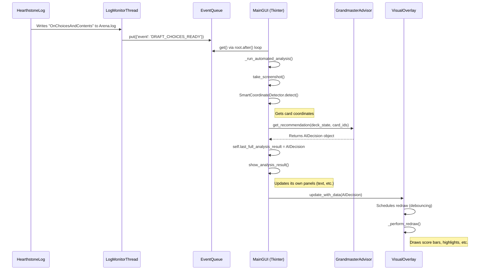
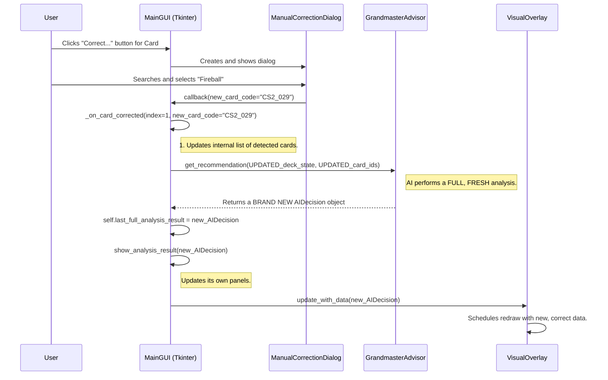

# ** The Grandmaster AI Coach: A Complete Implementation Plan**

## **Project Mission Statement**

The objective of this project is to implement a new, advanced AI system (`ai_v2`) for the Hearthstone Arena Bot. This system will transform the bot from a card detector into a "Grandmaster-level" strategic coach, specializing in the "The Underground" Arena mode. The final product will feature fully automated, real-time draft analysis, an interactive visual overlay, and a conversational AI component, all seamlessly integrated into the existing, production-ready application.

## **Guiding Architectural Principles**

*   **Modularity:** The entire new AI system will be built within a new `arena_bot/ai_v2/` directory to ensure zero negative impact on the existing, proven `DraftAdvisor`, allowing it to serve as a reliable fallback.
*   **Data-Driven:** All recommendations will be driven by a sophisticated, multi-dimensional analysis of the real-time draft state.
*   **User-Centric:** The user's chosen archetype is the primary driver of all AI decisions. The system is designed to teach and empower the user.
*   **Seamless Integration:** All new features must integrate perfectly with the existing GUI, including the robust manual card correction workflow, without introducing bugs or regressions.
*   **Performance:** All new features, especially the real-time overlay and hover detection, must be lightweight and not impact the performance of the game or the bot's UI.

---

## **Phase 0: Project Setup, Dependencies, and Configuration**

*Goal: Prepare the development environment, install all necessary libraries, and establish the foundational file structure and configuration for the new AI system.*

*   [ ] **1. Install New Dependencies:**
    *   **Action:** Update the project's requirements to include the libraries needed for the new AI system. Create a new `requirements_ai_v2.txt` file.
    *   **File Content (`requirements_ai_v2.txt`):**
        ```
        lightgbm==4.3.0
        scikit-learn==1.4.2
        pandas==2.2.2
        pywin32==306; sys_platform == 'win32'
        pyautogui==0.9.54
        ```
    *   **Instruction:** Run `pip install -r requirements_ai_v2.txt`.
    *   **Rationale:**
        *   `lightgbm`: The core machine learning library for our Gradient Boosted Decision Tree model, which will power the card scoring.
        *   `scikit-learn`: Used for data preprocessing (one-hot encoding) and model evaluation.
        *   `pandas`: Essential for creating and managing the training dataset for the `LightGBM` model.
        *   `pywin32`: **CRITICAL** for the Visual Overlay on Windows. It is required to set the `WS_EX_TRANSPARENT` window style, which makes the overlay "click-through."
        *   `pyautogui`: Required for the `HoverDetector` to get the real-time mouse cursor position.

*   [ ] **2. Create New AI Module Directory Structure:**
    *   **Action:** Create a new directory: `arena_bot/ai_v2/`.
    *   **Rationale:** To isolate the new Grandmaster AI system from the existing, proven `DraftAdvisor`, ensuring stability and allowing for easy fallback.
    *   **Create placeholder files within `arena_bot/ai_v2/`:**
        *   `__init__.py`
        *   `data_models.py`: Will contain the `dataclasses` that define our API contract.
        *   `archetype_config.py`: Will hold the scoring weights for each archetype.
        *   `card_evaluator.py`: Will house the `CardEvaluationEngine`.
        *   `deck_analyzer.py`: Will house the `StrategicDeckAnalyzer`.
        *   `grandmaster_advisor.py`: The main orchestrator for the AI.
        *   `redraft_specialist.py`: Logic for the "Re-Draft on Loss" mechanic.
        *   `conversational_coach.py`: The NLU and NLG for the Socratic Coach.

*   [ ] **3. Create New UI Module Files:**
    *   **Action:** Create placeholder files within the existing `arena_bot/ui/` directory.
    *   **Files to create:**
        *   `visual_overlay.py`: Will contain the `VisualIntelligenceOverlay` class.
        *   `hover_detector.py`: Will contain the `HoverDetector` class.
        *   `settings_dialog.py`: Will contain the `SettingsDialog` class.

*   [ ] **4. Define Core Data Structures (The API Contract):**
    *   **File:** `arena_bot/ai_v2/data_models.py`
    *   **Action:** Implement the following `dataclasses`. This is a critical step for ensuring seamless, bug-free integration between all new and existing components.
    *   **Code:**
        ```python
        from dataclasses import dataclass, field
        from typing import List, Dict, Tuple, Any

        @dataclass
        class DimensionalScores:
            card_id: str
            base_value: float = 0.0
            tempo_score: float = 0.0
            value_score: float = 0.0
            synergy_score: float = 0.0
            curve_score: float = 0.0
            re_draftability_score: float = 0.0
            greed_score: float = 0.0

        @dataclass
        class DeckState:
            hero: str
            chosen_archetype: str
            drafted_cards: List[str] # List of card IDs
            mana_curve: Dict[int, int] = field(default_factory=dict)
            pick_number: int = 0

        @dataclass
        class AIDecision:
            recommended_pick_index: int
            all_offered_cards_analysis: List[Dict[str, Any]]
            comparative_explanation: str
            deck_analysis: Dict[str, Any]
            card_coordinates: List[Tuple[int, int, int, int]]
            pivot_suggestion: Optional[str] = None
        ```

*   [ ] **5. Implement Archetype Configuration:**
    *   **File:** `arena_bot/ai_v2/archetype_config.py`
    *   **Action:** Create a centralized dictionary that holds the scoring weights for each of the six archetypes. This makes the AI's "personality" easily tunable.
    *   **Archetypes:** `Aggro`, `Tempo`, `Control`, `Synergy`, `Attrition`, `Balanced`.
    *   **Code Structure:**
        ```python
        ARCHETYPE_WEIGHTS = {
            "Aggro": {
                "base_value": 0.8,
                "tempo_score": 1.5,
                "value_score": 0.3,
                "synergy_score": 0.7,
                "curve_score": 1.2,
                "re_draftability_score": 1.0,
            },
            # ... define weights for all other 5 archetypes ...
        }
        ```

---

## **Phase 1: The Core AI Engine (The "Brain")**

*Goal: Build the non-visual, analytical components. Each component must be designed to be testable in isolation.*

*   [ ] **1. Implement the `CardEvaluationEngine`:**
    *   **File:** `arena_bot/ai_v2/card_evaluator.py`
    *   **Class:** `CardEvaluationEngine`
    *   **`__init__(self)`:**
        *   Load the `cards_json_loader` to access card data.
        *   Load the `HearthArenaTierManager` to get baseline tier/winrate data.
    *   **Method:** `evaluate_card(self, card_id: str, deck_state: DeckState) -> DimensionalScores`
    *   **Sub-tasks & Logic:**
        *   [ ] **Implement `_calculate_base_value`:** Fetch the HearthArena tier score and HSReplay winrate. Combine them into a normalized score (0-1).
        *   [ ] **Implement `_calculate_tempo_score`:** Analyze `card_id`'s mana cost versus its stats (`attack`, `health`) and immediate-impact keywords (`Rush`, `Charge`, `Battlecry: Deal damage`).
        *   [ ] **Implement `_calculate_value_score`:** Analyze keywords like `Discover`, `Draw a card`, `Lifesteal`, and resource-generating card text.
        *   [ ] **Implement `_calculate_synergy_score`:**
            *   Iterate through `deck_state.drafted_cards`.
            *   For each drafted card, check for matching tribes (`Murloc`, `Dragon`), keywords (`Spell Damage`), or mechanics.
            *   Implement the **Synergy Trap Detector:** If the current synergy package in the deck is weak (e.g., only one other Murloc), assign a low score even if the offered card has a synergy tag. The score should scale exponentially with the number of synergistic pieces already in the deck.
        *   [ ] **Implement `_calculate_curve_score`:** Calculate a score that is high if `deck_state.mana_curve` has a low count for the card's mana cost, and low if the slot is already full. This score should be weighted more heavily during the early-to-mid draft.
        *   [ ] **Implement `_calculate_re_draftability_score`:** Assign a high score to cards with simple "vanilla" stats and no unique text. Assign a very low score to unique Legendaries, key combo pieces, and powerful board clears.

*   [ ] **2. Implement the `StrategicDeckAnalyzer`:**
    *   **File:** `arena_bot/ai_v2/deck_analyzer.py`
    *   **Class:** `StrategicDeckAnalyzer`
    *   **Method:** `analyze_deck(self, deck_state: DeckState) -> Dict`
    *   **Sub-tasks & Logic:**
        *   [ ] **Implement Archetype Conformance:** Create a set of "ideal metrics" for each archetype (e.g., an "Aggro" deck should have an average mana cost < 3.0, >15 minions, etc.). Score the current deck against the ideal metrics for `deck_state.chosen_archetype`.
        *   [ ] **Implement Strategic Gap Analysis:** Based on the archetype, check for critical missing components. For example, if `deck_state.chosen_archetype` is 'Control' and `deck_state.pick_number` > 15, check if the deck contains any cards with the "AOE" tag. Return a list of human-readable warnings.
        *   [ ] **Implement "Cut Candidate" Logic:** For each card in `deck_state.drafted_cards`, calculate a "cut score" = `(1 - archetype_conformance_score) * re_draftability_score`. Return a sorted list of the top 5 cards with the highest cut scores.
        *   [ ] **Integrate Draft Phase Awareness:** The logic for all the above methods must check `deck_state.pick_number` and adjust its priorities accordingly (e.g., focus on curve in picks 1-10).

*   [ ] **3. Implement the `GrandmasterAdvisor`:**
    *   **File:** `arena_bot/ai_v2/grandmaster_advisor.py`
    *   **Class:** `GrandmasterAdvisor`
    *   **`__init__(self)`:** Instantiate the `CardEvaluationEngine` and `StrategicDeckAnalyzer`.
    *   **Method:** `get_recommendation(self, deck_state: DeckState, offered_card_ids: List[str]) -> AIDecision`
    *   **Sub-tasks & Logic:**
        1.  [ ] For each of the 3 `offered_card_ids`, call `self.card_evaluator.evaluate_card` to get its `DimensionalScores`.
        2.  [ ] Fetch the archetype weights from `archetype_config.py` based on `deck_state.chosen_archetype`.
        3.  [ ] Calculate the weighted `FinalScore` for each of the 3 cards.
        4.  [ ] **Implement the "Greed" Meter:** Calculate a Greed Score for each card by taking the standard deviation of its dimensional scores. A high variance means the card is specialized and "greedy."
        5.  [ ] **Implement the Dynamic Pivot Advisor:**
            *   Identify the card with the highest `FinalScore` as the default best pick.
            *   For the *other two* cards, temporarily re-calculate their `FinalScore` using the weights of *other* archetypes.
            *   If an alternative card's score for a different archetype is significantly higher (e.g., >30%) than the best pick's score for the current archetype, generate a "Pivot Suggestion" string.
        6.  [ ] **Generate the Comparative Explanation:** Create the detailed text explaining the recommendation, explicitly mentioning the key dimensional scores and comparing it to the alternatives.
        7.  [ ] **Run the Deck Analyzer:** Call `self.deck_analyzer.analyze_deck(deck_state)` to get the high-level deck analysis.
        8.  [ ] **Package and Return:** Assemble all of this information into the final `AIDecision` object and return it.

CONTINUE:

### **Part 2: The Visual Intelligence Overlay and Automation**

*Goal: Create the interactive, real-time overlay and the fully automated detection trigger, then seamlessly integrate them into the main GUI.*

*   [ ] **1. Implement the `VisualIntelligenceOverlay` Class:**
    *   **File:** `arena_bot/ui/visual_overlay.py`
    *   **Class:** `VisualIntelligenceOverlay`
    *   **Sub-tasks & Logic:**
        *   [ ] **`__init__(self, parent_root, monitor_geometry)`:**
            *   Accept the main Tkinter root and the target monitor's geometry `(x, y, w, h)`.
            *   Create a `tk.Toplevel()` window.
            *   Set its geometry to match the `monitor_geometry`.
            *   **Crucial:** Implement the platform-specific code for a borderless, transparent, always-on-top, and **click-through** window.
                *   `self.root.overrideredirect(True)` (borderless)
                *   `self.root.attributes('-topmost', True)` (always on top)
                *   `self.root.wm_attributes('-transparentcolor', 'black')` (transparency)
                *   **For Windows Click-Through (using `pywin32`):**
                    ```python
                    import win32gui
                    import win32con
                    hwnd = self.root.winfo_id()
                    styles = win32gui.GetWindowLong(hwnd, win32con.GWL_EXSTYLE)
                    win32gui.SetWindowLong(hwnd, win32con.GWL_EXSTYLE, styles | win32con.WS_EX_TRANSPARENT)
                    ```
        *   [ ] **`update_with_data(self, decision: AIDecision)` method:**
            *   Store the received `AIDecision` object.
            *   Implement the **debouncing** logic: cancel any pending `root.after` jobs and schedule a new `_perform_redraw` call in 50ms.
        *   [ ] **`_perform_redraw(self)` method:**
            *   This method will contain all the `self.canvas.create_*` calls.
            *   It will read the `card_coordinates` from the stored `AIDecision` object to know where to draw.
            *   It will read the scores and analysis to decide what to draw (e.g., the length of the score bars, the color of the highlight, the text of the tooltips).
            *   **Draw "At-a-Glance" Card Dashboards:** For each card, draw the score bars, archetype fit, and Greed/Re-Draftability meters.
            *   **Draw "Best Pick" Highlighter:** Apply a distinct visual effect to the bounding box of the recommended card.
        *   [ ] **`draw_synergy_links(self, from_card_index)` method:**
            *   This method will be called by the `HoverDetector`.
            *   It will draw animated lines from the hovered card's coordinates to the main GUI window's coordinates (where the decklist is). This will require passing the main GUI's geometry to the overlay.

*   [ ] **2. Implement the `HoverDetector` Class:**
    *   **File:** `arena_bot/ui/hover_detector.py`
    *   **Action:** Implement the class as designed previously.
    *   **`__init__(self, ui_queue)`:** Takes a thread-safe `queue.Queue` object for communication.
    *   **`update_card_regions(self, regions)`:** Public method for the main GUI to update the card coordinates.
    *   **`_run(self)`:** The main loop in the background thread. It will use `pyautogui.position()` and `time.time()` to implement the hover logic and will `put` events into the `ui_queue`.

*   [ ] **3. Implement the Automation Trigger in `HearthstoneLogMonitor`:**
    *   **File:** `hearthstone_log_monitor.py`
    *   **Action:** Add the new regex and the event-firing logic.
    *   **Regex:** `DRAFT_CHOICES_PATTERN = re.compile(r'DraftManager\.OnChoicesAndContents')`
    *   **Logic:** In the main log processing loop, if this pattern matches, put a `{'event': 'DRAFT_CHOICES_READY'}` message into the event queue that will be shared with the main GUI.

---

### **Part 3: Grand Integration into the Main Application**

*Goal: Tie all the new components together within the existing `integrated_arena_bot_gui.py`, creating a seamless, automated, and robust user experience.*

*   [ ] **1. Refactor `IntegratedArenaBotGUI.__init__`:**
    *   **File:** `integrated_arena_bot_gui.py`
    *   **Action:**
        *   Instantiate all the new `ai_v2` components (`GrandmasterAdvisor`, etc.).
        *   Instantiate the `HoverDetector` and `VisualIntelligenceOverlay`.
        *   Create the `self.event_queue = queue.Queue()`.
        *   Modify the `HearthstoneLogMonitor` initialization to pass it the `self.event_queue`.
        *   Add a new UI element: a dropdown menu for the user to select their desired archetype. Store the selection in a variable like `self.chosen_archetype`.

*   [ ] **2. Implement the Main Event Loop:**
    *   **File:** `integrated_arena_bot_gui.py`
    *   **Action:** Create a new method, `_check_for_events(self)`, that will be called periodically by `self.root.after(100, self._check_for_events)`.
    *   **Logic:**
        *   This method will perform a non-blocking check on `self.event_queue`.
        *   It will have a `case` or `if/elif` structure to handle different events:
            *   `'DRAFT_CHOICES_READY'`: Call a new `_run_automated_analysis()` method.
            *   `'socratic_hover'`: Get the `card_index` from the event and call the `ConversationalCoach` to generate and display a Socratic question.

*   [ ] **3. Create the `_run_automated_analysis` Method:**
    *   **File:** `integrated_arena_bot_gui.py`
    *   **Action:** This method encapsulates the entire automated workflow.
    *   **Logic:**
        1.  Log "Draft choices detected, starting automated analysis."
        2.  Call `take_screenshot()`.
        3.  Call `self.smart_detector.detect_cards_automatically()` to get the card coordinates.
        4.  Call the card identification pipeline to get the three `card_ids`.
        5.  Create the `DeckState` object using the current draft info.
        6.  Call `self.grandmaster_advisor.get_recommendation()` to get the final `AIDecision` object.
        7.  Store this object in `self.last_full_analysis_result`.
        8.  Call `self.show_analysis_result()` to update the main GUI.
        9.  Call `self.visual_overlay.update_with_data()` to update the visual overlay.

*   [ ] **4. Perfect the Manual Correction Workflow Integration:**
    *   **File:** `integrated_arena_bot_gui.py`
    *   **Action:** Refactor the `_on_card_corrected` method to ensure it follows the "full re-analysis" principle.
    *   **Logic:**
        1.  Receive the `new_card_code` from the dialog.
        2.  Update the internal list of detected card IDs.
        3.  **CRITICAL:** Call the *exact same* analysis pipeline as the automated process (`GrandmasterAdvisor.get_recommendation`).
        4.  This will return a brand new, completely consistent `AIDecision` object.
        5.  Update `self.last_full_analysis_result` with this new object.
        6.  Call the main UI update methods (`show_analysis_result`, `visual_overlay.update_with_data`) to refresh everything.
    *   **Rationale:** This guarantees that a manual correction is treated exactly like a fresh detection, ensuring data consistency and preventing stale recommendations.

*   [ ] **5. Implement the Final "Polish" Features:**
    *   [ ] **`SettingsDialog`:**
        *   Create the `SettingsDialog` class in `arena_bot/ui/settings_dialog.py`.
        *   Add the Tkinter UI elements (checkboxes) for all overlay options.
        *   Implement `_save_settings` and `_load_settings` methods that read/write from/to a `config.json` file.
    *   [ ] **Multi-Monitor Awareness:**
        *   In `IntegratedArenaBotGUI.__init__`, before creating the `VisualIntelligenceOverlay`, implement the logic to find the Hearthstone window's monitor and pass the correct geometry to the overlay's constructor. This will require the `mss` library.
    *   [ ] **Performance Throttling:**
        *   Ensure the `HoverDetector`'s check interval is configurable via the `config.json`.
        *   Verify that the `VisualIntelligenceOverlay`'s `update_with_data` method uses the debouncing logic with `root.after()`.

---

## **Phase 4: Finalization, Documentation, and Testing**

*Goal: Ensure the system is robust, well-documented, and thoroughly tested before deployment.*

*   [ ] **1. Comprehensive Testing Plan:**
    *   [ ] **Unit Tests:** Write tests for the `CardEvaluationEngine`'s scoring functions to ensure they behave as expected for known inputs.
    *   [ ] **Integration Test 1 (Automation):**
        1.  Start the bot and the log monitor.
        2.  Manually edit the `Arena.log` file to add an `OnChoicesAndContents` line.
        3.  Verify that the bot automatically takes a screenshot, performs the analysis, and updates both the GUI and the overlay.
    *   [ ] **Integration Test 2 (Manual Correction):**
        1.  Run the automated analysis.
        2.  Use the manual correction dialog to change one of the cards.
        3.  Verify that the AI recommendation, all UI panels, and the visual overlay update instantly and correctly.
    *   [ ] **Integration Test 3 (Hover & Socratic Coach):**
        1.  Run an analysis.
        2.  Move the mouse over each of the three card regions on the actual game screen.
        3.  Verify that the synergy lines are drawn correctly and that the Socratic questions appear after the specified delay.

*   [ ] **2. Documentation Update:**
    *   **Action:** Create a new, final section in `CLAUDE_ARENA_BOT_CHECKPOINT.md` titled "The Grandmaster AI Coach: Final Architecture."
    *   **Content:** This section will summarize this entire `todo.md`, explaining the new AI system, the automation, the visual overlay, and how all the components interact. It will serve as the definitive guide for any future work.
    *   **Action:** Add detailed docstrings to all new classes and public methods in the `ai_v2` and `ui` modules.

*   [ ] **3. Code Cleanup and Refinement:**
    *   **Action:** Review all new code for clarity, performance, and adherence to PEP 8 standards.
    *   **Action:** Ensure all debug messages and print statements are properly integrated into the bot's logging system and can be controlled via the main debug toggle.


***

## **Appendix: System Architecture & Integration Deep Dive**

*This appendix provides a comprehensive technical overview of the Grandmaster AI Coach system. It is intended to give the implementing AI (Claude Code) a complete and unambiguous understanding of the system's architecture, data flow, and core design principles.*

### **1. High-Level System Architecture**

The new AI system is a modular enhancement to the existing `integrated_arena_bot_gui.py`. The `IntegratedArenaBotGUI` class will act as the central "conductor," orchestrating all components.

```mermaid
graph TD
    subgraph "Main Application (integrated_arena_bot_gui.py)"
        A[Main GUI (Tkinter)]
    end

    subgraph "Input & Automation"
        B[HearthstoneLogMonitor] -- event_queue --> A
        C[HoverDetector Thread] -- event_queue --> A
        D[Screenshot Module] -- screenshot --> A
    end

    subgraph "AI Engine (arena_bot/ai_v2/)"
        E[GrandmasterAdvisor]
        F[CardEvaluationEngine]
        G[StrategicDeckAnalyzer]
        H[ConversationalCoach]
    end

    subgraph "Visual Output"
        I[VisualIntelligenceOverlay]
    end

    A -- "Get Recommendation" --> E
    E -- "Evaluate Card" --> F
    E -- "Analyze Deck" --> G
    A -- "User Chat" --> H
    H -- "Query Analysis" --> E
    A -- "Update Overlay" --> I

    style A fill:#3498DB,stroke:#2980B9,stroke-width:2px,color:#fff
    style I fill:#E67E22,stroke:#D35400,stroke-width:2px,color:#fff
    style E fill:#27AE60,stroke:#229954,stroke-width:2px,color:#fff
```

**Component Responsibilities:**

| Component | Module | Responsibility |
| :--- | :--- | :--- |
| **IntegratedArenaBotGUI** | `integrated_arena_bot_gui.py` | The central conductor. Manages the main UI, orchestrates all subsystems, holds the definitive application state, and handles the main event loop. |
| **HearthstoneLogMonitor** | `hearthstone_log_monitor.py` | (Existing) Runs in a background thread, monitors game logs, and sends events (like `DRAFT_CHOICES_READY`) to the GUI via a thread-safe queue. |
| **GrandmasterAdvisor** | `arena_bot/ai_v2/` | The primary entry point for the new AI. Takes the deck state and offered cards, and returns a comprehensive `AIDecision` object. |
| **VisualIntelligenceOverlay** | `arena_bot/ui/visual_overlay.py`| Renders the transparent, click-through overlay on the game screen based on the data in the `AIDecision` object. It is a "dumb" component that only draws what it's told. |
| **HoverDetector** | `arena_bot/ui/hover_detector.py`| Runs in a background thread, tracks the mouse position, and sends `socratic_hover` events to the GUI via the queue when the user hovers over a card choice. |
| **ConversationalCoach** | `arena_bot/ai_v2/` | Handles natural language requests from the user, queries the `GrandmasterAdvisor` for data, and generates templated responses. |

---

### **2. Data Flow Sequence Diagrams**

These diagrams illustrate the precise flow of information for the two most critical workflows.

#### **A. Automated Detection and Recommendation Workflow**



#### **B. Manual Card Correction Workflow**



---

### **3. Technology Rationale (The "Why")**

This section explicitly justifies the technology choices to prevent future ambiguity.

*   **GUI Framework (`Tkinter`):**
    *   **Reason:** It is **already in use** in the production-ready `integrated_arena_bot_gui.py`. It is a built-in Python library, requiring no new, heavy dependencies like PyQt or Kivy. This maximizes stability and minimizes the potential for installation issues.
    *   **Alternative Considered & Rejected:** `PyQt`. While more feature-rich, it would add a significant dependency and potential for conflicts with the existing Tkinter root window.

*   **Visual Overlay Click-Through (`pywin32`):**
    *   **Reason:** To create a truly seamless overlay, the user's mouse clicks must pass *through* our overlay window and register in the Hearthstone game client. Standard Tkinter does not support this. The `pywin32` library provides direct access to the Windows API, allowing us to set the `WS_EX_TRANSPARENT` style on our window, which is the standard, correct way to achieve this effect on Windows.
    *   **Alternative Considered & Rejected:** Emulating clicks. This is brittle, complex, and can be flagged by anti-cheat software. Direct click-through is the professional solution.

*   **Core Scoring Engine (`LightGBM`):**
    *   **Reason:** The task of predicting card performance based on a vector of features is a classic **tabular data problem**. Gradient Boosted Decision Trees (GBDTs) are the state-of-the-art for this type of problem. `LightGBM` is chosen for its industry-leading speed and memory efficiency, which is critical for real-time performance.
    *   **Alternative Considered & Rejected:** `Neural Networks`. While powerful, they are overkill for this structured data problem, require more complex architecture and tuning, and are significantly harder to interpret ("black box" problem). `LightGBM` provides feature importance scores, allowing us to debug and understand the AI's reasoning.

*   **Conversational AI (`Rule-Based NLU` + `Template-Based NLG`):**
    *   **Reason:** The scope of user queries is relatively narrow and domain-specific. A full-blown Large Language Model (LLM) is unnecessary, slow, and introduces the risk of "hallucinations" (providing incorrect, made-up information).
    *   **Our Approach:** A rule-based NLU (using regex and keywords) is 100% reliable for understanding the limited set of user intents. A template-based NLG gives us full, deterministic control over the AI's responses, ensuring they are always accurate and based directly on the analytical data. This is a safer, faster, and more reliable solution for this specific use case.

---

### **4. User Experience (UX) Flowchart: The Automated Draft**

This chart illustrates the intended user journey for the primary, automated workflow.

```mermaid
graph TD
    A(Start Arena Bot) --> B{Monitoring Active?};
    B -- No --> C[User clicks "Start Monitoring"];
    C --> D[Log Monitor Thread Starts];
    B -- Yes --> D;
    D --> E(Bot is Idle, waiting for game events);
    E --> F{Log Monitor detects<br/>'OnChoicesAndContents'};
    F -- Yes --> G[Auto-capture screenshot];
    G --> H[Run Full AI Analysis Pipeline];
    H --> I[Update Main GUI & Visual Overlay];
    I --> E;
    F -- No --> E;

    style A fill:#27AE60,color:#fff
    style I fill:#27AE60,color:#fff
```

---

### **5. The Implementation Contract for "Claude Code"**

To ensure a successful and stable implementation, the following architectural principles are non-negotiable and must be strictly adhered to:

1.  **The GUI is the Single Source of Truth:** The `IntegratedArenaBotGUI` class is the master controller. It owns the application state (like `self.last_full_analysis_result`). Other components (like the overlay) receive state from it but do not manage their own.
2.  **All Heavy Processing MUST Occur in Background Threads:** Any task that could take more than 50ms (file I/O, screenshot analysis, AI calculations) must be run in a `threading.Thread` to prevent freezing the `Tkinter` main loop.
3.  **Use the `queue.Queue` for Thread Communication:** All communication from a background thread back to the main GUI thread *must* go through the thread-safe `event_queue`. The main thread will poll this queue using `root.after()`.
4.  **The `AIDecision` Object is the Universal Data Contract:** The `GrandmasterAdvisor`'s *only* output is the `AIDecision` object. All UI components (main window and overlay) must be driven exclusively by the data contained within this object. This prevents data desynchronization.
5.  **New AI in `ai_v2`:** All new core AI logic (scoring, analysis, etc.) must be placed within the `arena_bot/ai_v2/` directory. The existing `arena_bot/ai/draft_advisor.py` must not be modified.
6.  **Respect Existing Systems:** The new features are enhancements. They must be integrated in a way that allows the bot to function gracefully if a new component fails or is disabled. The existing `SmartCoordinateDetector` and basic `HistogramMatcher` should always be available as fallbacks.


## **Appendix B: Implementation Strategy & Final Safeguards**

*This final appendix provides the strategic context for building the Grandmaster AI Coach. It outlines a phased implementation approach, a clear testing philosophy, and a robust plan for graceful degradation. This ensures the project is built in a logical, stable, and risk-managed manner.*

---

### **1. Phased Implementation Strategy: Building from a Stable Core**

This file is comprehensive, but the features should not be built in parallel. A phased approach is critical to ensure stability at each step.

**Phase 1: The Core AI "Brain" (Headless Development & Testing)**
*   **Goal:** Build and validate the entire analytical engine *without touching the GUI*.
*   **Modules to Complete:** `ai_v2/` (all modules: `data_models`, `archetype_config`, `card_evaluator`, `deck_analyzer`, `grandmaster_advisor`).
*   **Testing:** Create a simple script (`test_ai_v2.py`) that feeds a hardcoded `DeckState` and list of offered cards to the `GrandmasterAdvisor` and prints the resulting `AIDecision` object.
*   **Success Criteria:** The AI engine can produce a complete, logical `AIDecision` object for a variety of test scenarios without errors.

**Phase 2: Automation & Core GUI Integration**
*   **Goal:** Connect the proven AI brain to the main application and automate the analysis trigger.
*   **Modules to Modify:** `hearthstone_log_monitor.py`, `integrated_arena_bot_gui.py`.
*   **Implementation Steps:**
    1.  Implement the log-based trigger (`OnChoicesAndContents`).
    2.  Implement the thread-safe `event_queue` and the `_check_for_events` loop in the main GUI.
    3.  Create the `_run_automated_analysis` method, which calls the now-tested `GrandmasterAdvisor`.
    4.  Update the **existing** text-based and image-based UI elements in the main GUI to display the results from the `AIDecision` object.
*   **Success Criteria:** When a draft screen appears, the bot automatically runs a full analysis and displays the correct recommendation and explanation in the main GUI window. The "Analyze Screenshot" button should produce the exact same result. The system is fully functional at this point, just without the advanced overlay.

**Phase 3: The Visual Intelligence Overlay**
*   **Goal:** Build the interactive, transparent overlay system.
*   **Modules to Create/Modify:** `ui/visual_overlay.py`, `ui/hover_detector.py`, `integrated_arena_bot_gui.py`.
*   **Implementation Steps:**
    1.  Build the transparent, click-through `VisualIntelligenceOverlay` class.
    2.  Build the `HoverDetector` thread.
    3.  Integrate them into the main GUI. The `_run_automated_analysis` method will now also call `self.visual_overlay.update_with_data()`.
*   **Success Criteria:** The overlay appears on the correct monitor, is fully transparent and click-through, and correctly displays the analysis results (score bars, highlights) directly over the game screen.

**Phase 4: The Conversational Coach & Final Polish**
*   **Goal:** Implement the final layer of user interaction and configuration.
*   **Modules to Create/Modify:** `ai_v2/conversational_coach.py`, `ui/settings_dialog.py`.
*   **Implementation Steps:**
    1.  Build the rule-based NLU and template-based NLG for the `ConversationalCoach`.
    2.  Integrate the coach with the `HoverDetector`'s `'socratic_hover'` event.
    3.  Build the `SettingsDialog` and link it to a `config.json` file.
    4.  Refactor the `VisualIntelligenceOverlay` to respect the settings from the `config.json`.
*   **Success Criteria:** The user can ask questions, receive Socratic coaching on hover, and configure the overlay's appearance, with settings persisting between sessions.

---

### **2. The Data Pipeline & Machine Learning Model Plan**

The `LightGBM` model is a core component, but it requires training data. Attempting to generate this data and train the model from scratch is a massive sub-project. Therefore, the following strategy **must** be employed to prevent development from being blocked.

*   **Initial Implementation (Heuristic-Based):**
    *   The `CardEvaluationEngine`'s `_calculate_base_value` method will **not** initially use a machine learning model.
    *   Instead, it will use a robust, **heuristic-based formula** that combines the existing HearthArena tier score and HSReplay winrate data.
    *   **Example Heuristic:** `base_value = (hearth_arena_score / 100) * 0.6 + (hsreplay_winrate - 0.5) * 0.4`.
    *   **Rationale:** This provides a strong, reliable baseline score that allows the entire rest of the AI system to be built and tested. The `LightGBM` model can be treated as a future enhancement.

*   **Future Enhancement (Model Training):**
    *   A separate script (`scripts/build_training_data.py`) will be created to process HSReplay data into a `.csv` or `.parquet` file.
    *   Another script (`scripts/train_model.py`) will use this data to train the `LightGBM` model and save it to a file (e.g., `assets/models/card_scorer.lgb`).
    *   The `CardEvaluationEngine` will be designed to load and use this model file *if it exists*, otherwise it will fall back to the heuristic. This makes the ML model a "drop-in" enhancement.

---

### **3. Graceful Degradation & Dependency Management**

The bot must be resilient. If a new, non-critical dependency is missing, the bot should still run, albeit with reduced functionality.

| If This Dependency is Missing... | The Bot Will... | Action to Take |
| :--- | :--- | :--- |
| `lightgbm`, `scikit-learn`, `pandas` | ...fall back to the heuristic-based `base_value` calculation. The advanced AI will still function, but with slightly less accurate base scores. | Log a `WARNING` message: "Machine learning libraries not found. Using heuristic scoring." |
| `pywin32` (on Windows) | ...still display the `VisualIntelligenceOverlay`, but it will **not** be click-through. | Log a `WARNING` and display a one-time message in the GUI: "Overlay is not click-through. Install 'pywin32' for the best experience." |
| `pyautogui` | ...disable the `HoverDetector` and the Socratic Coach feature. | Log a `WARNING`: "pyautogui not found. Socratic hover coaching is disabled." |

This approach ensures that the core functionality of the bot is never broken by an optional enhancement.

---

### **4. The Complete User Journey Flowchart (Grandmaster Edition)**

This flowchart illustrates the perfected, end-to-end user experience.

```mermaid
graph TD
    subgraph "Setup (Once per Draft)"
        A[User starts Arena run] --> B[LogMonitor detects new draft];
        B --> C{Select Archetype};
        C -- User chooses "Control" --> D[AI sets scoring weights];
    end
    
    subgraph "Automated Pick Cycle (Picks 1-30)"
        E[Hearthstone presents 3 cards] --> F[LogMonitor fires 'DRAFT_CHOICES_READY'];
        F --> G[GUI auto-captures screenshot];
        G --> H[AI Engine runs full analysis];
        H --> I[AIDecision object is created];
        I --> J[Main GUI & Visual Overlay are updated];
    end
    
    subgraph "Interactive Coaching (Optional)"
        J --> K{User hovers over a card};
        K -- > 2.5s --> L[HoverDetector fires 'socratic_hover'];
        L --> M[ConversationalCoach asks a guiding question];
    end
    
    subgraph "Manual Correction (If Needed)"
        J --> N{User spots detection error};
        N --> O[User clicks "Correct..."];
        O --> P[User selects correct card];
        P --> Q[GUI re-runs AI with corrected data];
        Q --> I;
    end
    
    subgraph "Redraft Cycle (After a Loss)"
        R{LogMonitor detects a loss} --> S[Redraft Specialist activates];
        S --> T[ConversationalCoach asks about loss context];
        T --> U[User provides context (e.g., "aggro")];
        U --> V[AI provides prioritized swap recommendations];
        V --> W[User makes swaps];
        W --> E;
    end

    D --> E;
```

---

### **5. Final Commandments for the Implementing AI (Claude Code)**

These are the non-negotiable principles for this implementation.

1.  **Thou Shalt Not Block the Main Thread.** All I/O (log reading, screenshots) and all heavy computation (AI analysis) *must* be offloaded to background threads. The Tkinter GUI must remain responsive at all times.
2.  **The `AIDecision` Object is Sacred.** It is the single, immutable source of truth for any given analysis state. Do not modify it after creation. To update the state (e.g., after a manual correction), generate a *new* `AIDecision` object by re-running the entire analysis pipeline.
3.  **The GUI is the Conductor.** The `IntegratedArenaBotGUI` class orchestrates everything. It receives events, calls the appropriate systems, and distributes the resulting state to all UI components. AI modules analyze; the GUI commands.
4.  **Embrace Graceful Degradation.** The bot must function even if advanced dependencies are missing. Implement fallbacks as described. The user experience should degrade gracefully, not crash.
5.  **Build and Test in Phases.** Follow the phased implementation strategy. Ensure each layer is stable and unit-tested before integrating the next. Build the headless "brain" first, then connect it to the GUI "body."

